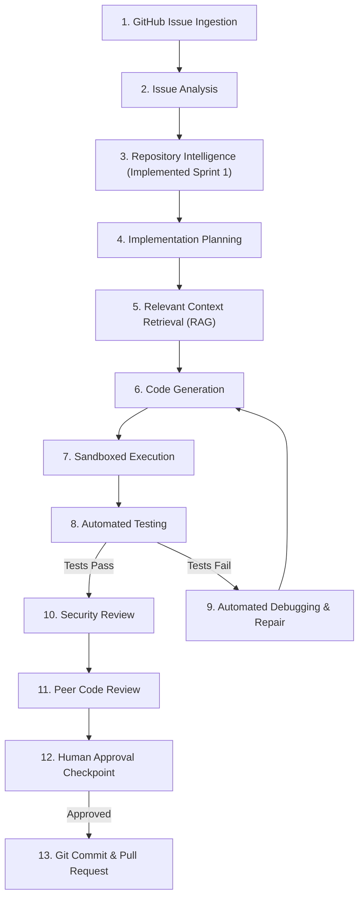

# AgentForge

> Autonomous AI Software Engineer — from GitHub Issue to Tested Pull Request.

[](https://github.com/swikarb69/AgentForge/actions/workflows/ci.yml)
[](LICENSE)
[](pyproject.toml)
[](https://github.com/astral-sh/ruff)
[](https://mypy-lang.org/)

AgentForge is an autonomous AI software-engineering agent designed to take a GitHub issue, analyze the target repository, formulate a minimal implementation plan, synthesize code and tests, execute tests inside an isolated sandbox, repair failures automatically, perform security and peer code reviews, and deliver an auditable Pull Request.

The core operational principle governing AgentForge is:

$$\text{Understand} \longrightarrow \text{Plan} \longrightarrow \text{Implement} \longrightarrow \text{Verify} \longrightarrow \text{Repair} \longrightarrow \text{Review} \longrightarrow \text{Ship}$$

---

## Current Project Status

> [!NOTE]
> **Sprint 1 — Repository Intelligence (Current Release: v0.2.0)**
>
> AgentForge is being built incrementally using an **Agile + Scrum-inspired iterative methodology**.
>
> **Implemented in Sprint 0 & 1**:
> - Core FastAPI application foundation (`backend/app/main.py`) & Pydantic settings config (`backend/app/core/config.py`).
> - **Repository Scanner**: Recursive file tree scanner (`backend/app/repository/scanner.py`) enforcing path traversal validation, file size limits (`MAX_FILE_SIZE = 1MB`), binary file detection, and `.gitignore` pattern filtering.
> - **Language Detection & Metadata**: Extension-to-language mapping and test file classifier (`backend/app/repository/metadata.py`).
> - **Python AST Code Intelligence**: Standard library AST parser (`backend/app/parsing/python_parser.py`) extracting classes, functions, class methods with parent bindings, import statements, parameter signatures, and docstrings.
> - **Structural Code Chunking**: Semantic Python chunker (`backend/app/indexing/chunker.py`) creating symbol-bounded code chunks, and line-based fallback chunking for non-Python codebases.
> - **In-Memory Repository Index & Deterministic Search**: Fast in-memory index engine (`backend/app/indexing/index.py`) providing ranked keyword and symbol search.
> - **Repository APIs**: OpenAPI endpoints (`POST /api/v1/repositories/analyze` and `POST /api/v1/repositories/search`).
> - **Testing Architecture**: Pytest unit, integration, and pipeline test suite (`tests/`) verified with 100% coverage.
> - **CI/CD & Security**: GitHub Actions pipeline (`.github/workflows/ci.yml`) enforcing Ruff, MyPy, Bandit, and Pytest.
>
> *Note: AI Agent orchestration, RAG retrieval augmentation, GitHub API integration, and container sandbox execution runners are planned for Sprints 2–8.*

---

## Why AgentForge?

Building reliable AI software engineering agents requires far more than wrapping an LLM in a loop. Monolithic code generation leads to regression bugs, bloated diffs, and security vulnerabilities.

AgentForge addresses these issues through:
1. **Repository Intelligence & RAG**: Context extraction via file tree analysis, AST parsing, and symbol indexing.
2. **Specialized Multi-Agent System**: 9 single-responsibility agents (Repo Analyst, Issue Analyst, Planner, Coder, Test Agent, Debugger, Security Agent, Code Reviewer, PR Agent).
3. **Sandboxed Code Execution**: Docker container isolation operating under strict CPU, memory, timeout, and network constraints.
4. **Automated Multi-Turn Repair Loop**: Test-driven failure analysis and patch refinement prior to human review.
5. **Deterministic Security Controls**: Hard limits against command injection, secret leakage, and path traversal.
6. **Human-in-the-Loop Control**: Configurable approval gates before committing or opening pull requests.

---

## End-to-End Operational Workflow



---

## Technology Stack

- **Language**: Python 3.13+
- **API Framework**: FastAPI & Uvicorn
- **Configuration & Validation**: Pydantic v2 & Pydantic Settings
- **Testing**: Pytest, Pytest-Cov, Pytest-Asyncio
- **Code Quality & Formatting**: Ruff, MyPy
- **Security Scanner**: Bandit
- **Containerization**: Docker & Docker Compose
- **CI/CD**: GitHub Actions

---

## Repository Structure

```text
AgentForge/
├── backend/
│   └── app/
│       ├── __init__.py
│       ├── main.py                    # FastAPI entrypoint
│       ├── api/
│       │   └── routes/
│       │       └── repositories.py   # Repository Analysis & Search APIs
│       ├── core/
│       │   └── config.py              # Pydantic Settings
│       ├── indexing/
│       │   ├── chunker.py             # Structural code chunker
│       │   └── index.py               # In-memory repository index & search
│       ├── parsing/
│       │   ├── python_parser.py       # Python AST parser
│       │   └── symbols.py             # AST node helpers
│       └── repository/
│           ├── analyzer.py            # High-level RepositoryAnalyzer pipeline
│           ├── filters.py             # Path validation & ignore rules
│           ├── metadata.py            # Language detection & test classifier
│           ├── models.py              # Pydantic data schemas
│           └── scanner.py             # Recursive filesystem scanner
│
├── agentforge-fixtures/
│   └── sample-project/                # Fixture repository for integration testing
│
├── sandbox/
│   ├── Dockerfile                    # Isolated sandbox container baseline
│   └── policies/
│       └── security_policy.json       # Baseline security limits & policy schema
│
├── tests/
│   ├── unit/                          # Unit test suite
│   └── integration/                   # Pipeline & API integration test suite
│
├── docs/                              # Architecture & specification docs
│   ├── architecture.md
│   ├── development-methodology.md
│   ├── repository-intelligence.md
│   ├── security.md
│   ├── testing.md
│   ├── deployment.md
│   └── roadmap.md
│
├── .github/
│   └── workflows/
│       └── ci.yml                    # GitHub Actions CI pipeline
│
├── .env.example                      # Environment variables template
├── .gitignore                        # Git exclusion rules
├── CHANGELOG.md                      # Release notes
├── CONTRIBUTING.md                   # Contribution guidelines
├── LICENSE                           # MIT License
├── README.md                         # Documentation
├── docker-compose.yml                # Local container orchestration
└── pyproject.toml                    # Build & tool configuration
```

---

## Quick Start & Usage

### 1. Setup Local Environment
```bash
# Clone repository
git clone https://github.com/swikarb69/AgentForge.git
cd AgentForge

# Create and activate virtual environment
python -m venv .venv
# Windows:
.venv\Scripts\activate
# Linux/macOS:
source .venv/bin/activate

# Install dependencies
pip install -e ".[dev]"
```

### 2. Run FastAPI Application
```bash
uvicorn backend.app.main:app --reload --port 8000
```
Endpoints:
- Health Check: `http://localhost:8000/api/v1/health`
- Version Info: `http://localhost:8000/api/v1/version`
- Analyze Repository: `POST http://localhost:8000/api/v1/repositories/analyze`
- Search Repository: `POST http://localhost:8000/api/v1/repositories/search`
- OpenAPI Docs: `http://localhost:8000/docs`

---

## Testing & Quality Verification

Run the full local quality and verification suite:

```bash
# Run Ruff Linters & Formatters
ruff check .
ruff format --check .

# Run MyPy Static Type Check
mypy backend/app

# Run Bandit Security Scanner
bandit -r backend/app

# Run Unit & Integration Tests with Coverage
pytest --cov=backend/app --cov-report=term-missing
```

---

## Planned 11-Sprint Roadmap

- **Sprint 0 — Foundation** (COMPLETED): Base application structure, config, testing, CI, docs.
- **Sprint 1 — Repository Intelligence** (COMPLETED): Scanner, AST parser, chunker, in-memory index, search API.
- **Sprint 2 — Issue Understanding** (NEXT): GitHub issue parser, acceptance criteria generator.
- **Sprint 3 — Planning Agent**: Implementation planner, touch-set isolator.
- **Sprint 4 — Context Synthesis & Coding Agent**: Code RAG indexer and code generator.
- **Sprint 5 — Execution Sandbox Engine**: Isolated Docker execution runner and resource caps.
- **Sprint 6 — Test Generation & Automated Debugger**: Automated test creation & repair loop.
- **Sprint 7 — Security & Code Review Engine**: Secret scanner, prompt injection defender, code reviewer.
- **Sprint 8 — GitHub Integration & PR Shipping**: Git branch creator, commit and PR generator.
- **Sprint 9 — Evaluation & Benchmarks**: Benchmark evaluation suite and token/cost trackers.
- **Sprint 10 — Production Polish**: Developer UI dashboard and final audit.

For comprehensive sprint details, read [docs/roadmap.md](docs/roadmap.md).

---

## License

AgentForge is released under the **MIT License**. See [LICENSE](LICENSE) for details.

Copyright (c) 2026 **Swikar Bhattarai**

---

## Author

**Swikar Bhattarai**  
Repository: [https://github.com/swikarb69/AgentForge.git](https://github.com/swikarb69/AgentForge.git)
