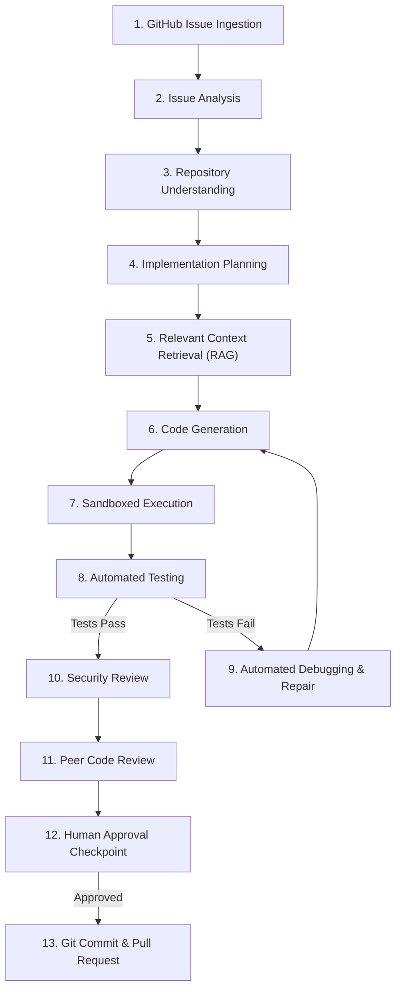

# AgentForge

> Autonomous AI Software Engineer — from GitHub Issue to Tested Pull Request.

[](https://github.com/swikarb69/AgentForge/actions/workflows/ci.yml)
[](LICENSE)
[](pyproject.toml)
[](https://github.com/astral-sh/ruff)
[](https://mypy-lang.org/)

AgentForge is an autonomous AI software-engineering agent designed to take a GitHub issue, analyze the target repository, formulate a minimal implementation plan, synthesize code and tests, execute tests inside an isolated sandbox, repair failures automatically, perform security and peer code reviews, and deliver an auditable Pull Request.

The core operational principle governing AgentForge is:

$$\text{Understand} \longrightarrow \text{Plan} \longrightarrow \text{Implement} \longrightarrow \text{Verify} \longrightarrow \text{Repair} \longrightarrow \text{Review} \longrightarrow \text{Ship}$$

---

## Current Project Status

> [!NOTE]
> **Sprint 0 — Foundation (Current Release: v0.1.0)**
>
> AgentForge is currently under active development using an **Agile + Scrum-inspired iterative methodology**.
>
> **Implemented in Sprint 0**:
> - Core FastAPI application foundation (`backend/app/main.py`) exposing health and version endpoints.
> - Type-safe Pydantic Settings system (`backend/app/core/config.py`).
> - Baseline container execution environment (`sandbox/Dockerfile`) and security policy schema (`sandbox/policies/security_policy.json`).
> - Pytest test suite setup covering unit, integration, and configuration behavior.
> - GitHub Actions CI workflow (`.github/workflows/ci.yml`) enforcing Ruff linting, MyPy type checks, Bandit security scans, and Pytest coverage.
> - Architectural documentation suite (`docs/`).
>
> *Note: AI Agent orchestration, RAG indexing, sandbox execution enforcement, and GitHub API interactions are planned for Sprints 1–8.*

---

## Why AgentForge?

Building reliable AI software engineering agents requires far more than wrapping an LLM in a loop. Monolithic code generation leads to regression bugs, bloated diffs, and security vulnerabilities.

AgentForge addresses these issues through:
1. **Repository Intelligence & RAG**: Context extraction via file tree analysis, AST parsing, and symbol indexing.
2. **Specialized Multi-Agent System**: 9 single-responsibility agents (Repo Analyst, Issue Analyst, Planner, Coder, Test Agent, Debugger, Security Agent, Code Reviewer, PR Agent).
3. **Sandboxed Code Execution**: Docker container isolation operating under strict CPU, memory, timeout, and network constraints.
4. **Automated Multi-Turn Repair Loop**: Test-driven failure analysis and patch refinement prior to human review.
5. **Deterministic Security Controls**: Hard limits against command injection, secret leakage, and path traversal.
6. **Human-in-the-Loop Control**: Configurable approval gates before committing or opening pull requests.

---

## End-to-End Planned Workflow



---

## Technology Stack

- **Language**: Python 3.13+
- **API Framework**: FastAPI & Uvicorn
- **Configuration & Validation**: Pydantic v2 & Pydantic Settings
- **Testing**: Pytest, Pytest-Cov, Pytest-Asyncio
- **Code Quality & Formatting**: Ruff, MyPy
- **Security Scanner**: Bandit
- **Containerization**: Docker & Docker Compose
- **CI/CD**: GitHub Actions

---

## Repository Structure

```text
AgentForge/
├── backend/
│   └── app/
│       ├── __init__.py
│       ├── main.py              # FastAPI application entrypoint
│       └── core/
│           ├── __init__.py
│           └── config.py        # Pydantic Settings configuration
│
├── sandbox/
│   ├── Dockerfile              # Isolated sandbox container baseline
│   └── policies/
│       └── security_policy.json # Baseline security limits & policy schema
│
├── tests/
│   ├── unit/
│   │   ├── test_health.py      # Health & version API endpoint tests
│   │   └── test_config.py      # Configuration & env override tests
│   └── integration/
│       └── test_app_init.py    # FastAPI initialization & OpenAPI tests
│
├── docs/                        # Architectural & engineering specifications
│   ├── architecture.md
│   ├── development-methodology.md
│   ├── agent-system.md
│   ├── security.md
│   ├── testing.md
│   ├── deployment.md
│   └── roadmap.md
│
├── .github/
│   └── workflows/
│       └── ci.yml              # GitHub Actions CI pipeline
│
├── .env.example                # Environment variables template
├── .gitignore                  # Git exclusion rules
├── CHANGELOG.md                # Sprint release notes
├── CONTRIBUTING.md             # Contribution guidelines
├── LICENSE                     # MIT License
├── README.md                   # Project documentation
├── docker-compose.yml          # Local container orchestration
└── pyproject.toml              # Build, dependencies, and tool settings
```

---

## Quick Start & Installation

### 1. Prerequisites
- Python 3.13+
- Git
- Docker (optional for Sprint 0, required for sandbox features in Sprint 5)

### 2. Setup Local Environment
```bash
# Clone repository
git clone https://github.com/swikarb69/AgentForge.git
cd AgentForge

# Create and activate virtual environment
python -m venv .venv
# On Windows:
.venv\Scripts\activate
# On Linux/macOS:
source .venv/bin/activate

# Install dependencies in editable mode
pip install -e ".[dev]"

# Configure environment variables
cp .env.example .env
```

### 3. Run FastAPI Application
```bash
uvicorn backend.app.main:app --reload --port 8000
```
API Endpoints:
- Health Check: `http://localhost:8000/api/v1/health`
- Version Info: `http://localhost:8000/api/v1/version`
- Interactive OpenAPI Docs: `http://localhost:8000/docs`

---

## Testing & Quality Verification

Run the full local quality and verification suite:

```bash
# Run Ruff Linters & Formatters
ruff check .
ruff format --check .

# Run MyPy Static Type Check
mypy backend/app

# Run Bandit Security Scanner
bandit -r backend/app

# Run Unit & Integration Tests with Coverage
pytest --cov=backend/app --cov-report=term-missing
```

---

## Planned 11-Sprint Roadmap

- **Sprint 0 — Foundation** (CURRENT): Base application structure, config, testing, CI, and docs.
- **Sprint 1 — Repository Intelligence**: Repo scanner, file tree builder, AST symbol extractor.
- **Sprint 2 — Issue Understanding**: GitHub issue parser, acceptance criteria generator.
- **Sprint 3 — Planning Agent**: Implementation planner, touch-set isolator.
- **Sprint 4 — Context Synthesis & Coding Agent**: Code RAG indexer and code generator.
- **Sprint 5 — Execution Sandbox Engine**: Isolated Docker execution runner and resource caps.
- **Sprint 6 — Test Generation & Automated Debugger**: Automated test creation & repair loop.
- **Sprint 7 — Security & Code Review Engine**: Secret scanner, prompt injection defender, code reviewer.
- **Sprint 8 — GitHub Integration & PR Shipping**: Git branch creator, commit and PR generator.
- **Sprint 9 — Evaluation & Benchmarks**: Benchmark evaluation suite and token/cost trackers.
- **Sprint 10 — Production Polish**: Developer UI dashboard and final audit.

For comprehensive sprint details, read [docs/roadmap.md](docs/roadmap.md).

---

## License

AgentForge is released under the **MIT License**. See [LICENSE](LICENSE) for details.

Copyright (c) 2026 **Swikar Bhattarai**

---

## Author

**Swikar Bhattarai**  
Repository: [https://github.com/swikarb69/AgentForge.git](https://github.com/swikarb69/AgentForge.git)
