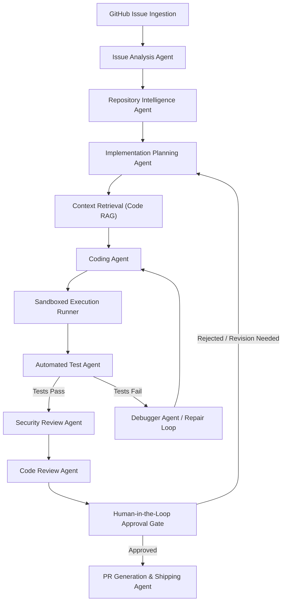

# AgentForge System Architecture

This document presents the technical architecture, core operational workflow, module boundaries, and system components of **AgentForge**.

---

## 1. System Implementation Status

> [!IMPORTANT]
> **Current Status**: **Sprint 0 — Foundation**
>
> - **IMPLEMENTED IN SPRINT 0**: Core FastAPI application structure, Pydantic settings configuration, baseline sandbox Dockerfile and security policy JSON, unit/integration testing framework, GitHub Actions CI workflow, and documentation skeleton.
> - **PLANNED FOR FUTURE SPRINTS**: AI Agent orchestration, RAG repository indexing, GitHub API issue/PR integration, Docker sandbox runtime isolation, automated repair loop, and developer UI dashboard.

---

## 2. End-to-End Operational Workflow

The complete operational flow of AgentForge transforms an input GitHub issue into a verified, reviewed Pull Request:



---

## 3. High-Level Architectural Components

```text
┌────────────────────────────────────────────────────────────────────────┐
│                        AgentForge Orchestrator                         │
└───────────────────────────────────┬────────────────────────────────────┘
                                    │
    ┌───────────────────────────────┼───────────────────────────────┐
    │                               │                               │
    ▼                               ▼                               ▼
┌───────────────────────┐ ┌───────────────────┐ ┌───────────────────────┐
│ Repository & Issue    │ │ AI Agent Engine   │ │ Code RAG & Context    │
│ Ingestion Layer       │ │ (9 Specialized)   │ │ Indexing Pipeline     │
└───────────────────────┘ └─────────┬─────────┘ └───────────────────────┘
                                    │
                                    ▼
┌───────────────────────┐ ┌───────────────────┐ ┌───────────────────────┐
│ Isolated Execution    │ │ Security & Policy │ │ GitHub Integration &  │
│ Docker Sandbox        │ │ Audit Engine      │ │ PR Generation Engine  │
└───────────────────────┘ └───────────────────┘ └───────────────────────┘
```

### Component Descriptions:

1. **API & Orchestration Layer** (`backend/app/orchestration/`) [Planned]:
   Controls state machine transitions, event streams, run lifecycles, retries, cost tracking, and human-in-the-loop pause points.

2. **Repository Intelligence & RAG** (`backend/app/retrieval/`) [Planned]:
   Performs file tree analysis, AST parsing, symbol mapping, keyword indexing, and semantic vector retrieval to feed minimal precise context to the agents.

3. **Multi-Agent Engine** (`backend/app/agents/`) [Planned]:
   Specialized prompt drivers for analysis, planning, code synthesis, debugging, security auditing, code review, and PR creation.

4. **Sandboxed Execution Engine** (`sandbox/`) [Sprint 0 Baseline / Full in Sprint 5]:
   Containerized Docker runner operating under strict CPU, memory, timeout, and network policies to execute tests without risking host environment integrity.

5. **Security & Policy Audit Engine** (`backend/app/security/`) [Planned]:
   Deterministic safety rules checking generated diffs for prompt injection, secret leaks, path traversal, command injection, and dangerous shell calls.

6. **GitHub Integration Layer** (`backend/app/github/`) [Planned]:
   Communicates via GitHub REST/GraphQL APIs to fetch issue metadata, comments, repository contents, create branches, commit code, and open PRs.

---

## 4. State Machine Lifecycle

AgentForge runs tasks using a strict deterministic state machine:

$$\text{RECEIVED} \rightarrow \text{ANALYZING} \rightarrow \text{PLANNING} \rightarrow \text{IMPLEMENTING} \rightarrow \text{TESTING} \rightarrow \text{DEBUGGING} \rightarrow \text{SECURITY\_REVIEW} \rightarrow \text{CODE\_REVIEW} \rightarrow \text{HUMAN\_APPROVAL} \rightarrow \text{SHIPPING} \rightarrow \text{COMPLETED}$$

Each state requires explicit validation criteria to transition forward, with fail-safe rollback to `HUMAN_REVIEW_REQUIRED` upon exceeding maximum retries or detecting critical security violations.
