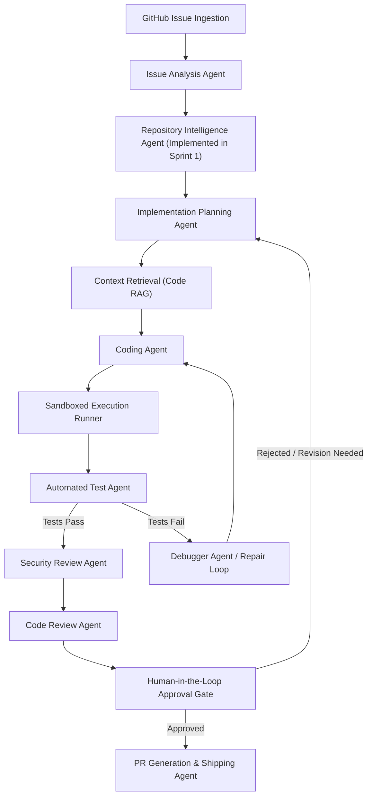

# AgentForge System Architecture

This document presents the technical architecture, core operational workflow, module boundaries, and system components of **AgentForge**.

---

## 1. System Implementation Status

> [!IMPORTANT]
> **Current Status**: **Sprint 1 — Repository Intelligence**
>
> - **IMPLEMENTED IN SPRINT 0 & 1**:
>   - FastAPI core application & Pydantic configuration (`backend/app/main.py`, `backend/app/core/config.py`).
>   - Repository Scanner, Filters, & Metadata Engine (`backend/app/repository/`).
>   - Python AST Parser & Symbol Extraction Engine (`backend/app/parsing/`).
>   - Structural & Fallback Code Chunker (`backend/app/indexing/chunker.py`).
>   - In-Memory Repository Index & Deterministic Search Engine (`backend/app/indexing/index.py`).
>   - Repository Analysis & Search APIs (`/api/v1/repositories/analyze`, `/api/v1/repositories/search`).
>   - Baseline Sandbox Dockerfile and Security Policy JSON (`sandbox/`).
>   - Unit, Integration, & Pipeline Test Suites with 100% Code Coverage (`tests/`).
>   - GitHub Actions CI Pipeline (`.github/workflows/ci.yml`).
>
> - **PLANNED FOR FUTURE SPRINTS**: AI Agent orchestration, RAG retrieval augmentation, GitHub API issue/PR integration, Docker sandbox runtime isolation, automated repair loop, and developer UI dashboard.

---

## 2. End-to-End Operational Workflow



---

## 3. High-Level Architectural Components

```text
┌────────────────────────────────────────────────────────────────────────┐
│                        AgentForge Orchestrator                         │
└───────────────────┬────────────────────────────────────┬───────────────┘
                    │                                    │
    ┌───────────────┴───────────────┐                    │
    ▼                               ▼                    ▼
┌───────────────────────┐ ┌───────────────────┐ ┌───────────────────────┐
│ Repository            │ │ AI Agent Engine   │ │ Code RAG & Context    │
│ Intelligence Subsystem│ │ (9 Specialized)   │ │ Indexing Pipeline     │
│ (Implemented Sprint 1)│ │                   │ │ (In-Memory Sprint 1)  │
└───────────────────────┘ └─────────┬─────────┘ └───────────────────────┘
                                    │
                                    ▼
┌───────────────────────┐ ┌───────────────────┐ ┌───────────────────────┐
│ Isolated Execution    │ │ Security & Policy │ │ GitHub Integration &  │
│ Docker Sandbox        │ │ Audit Engine      │ │ PR Generation Engine  │
└───────────────────────┘ └───────────────────┘ └───────────────────────┘
```
