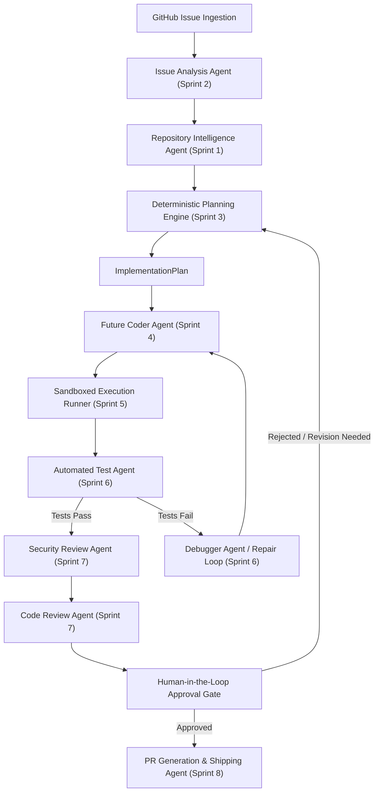

# AgentForge System Architecture

This document presents the technical architecture, core operational workflow, module boundaries, and system components of **AgentForge**.

---

## 1. System Implementation Status

> [!IMPORTANT]
> **Current Status**: **Sprint 5 — Execution & Verification Sandbox**
>
> - **IMPLEMENTED IN SPRINTS 0, 1, 2, 3, 4 & 5**:
>   - FastAPI core application & Pydantic configuration (`backend/app/main.py`, `backend/app/core/config.py`).
>   - Repository Intelligence Subsystem (`backend/app/repository/`, `backend/app/parsing/`, `backend/app/indexing/`).
>   - Issue Intelligence Subsystem (`backend/app/issue/`): Parser, Requirement Extractor, Reference Extractor, Repository Matcher, Issue Context Pipeline.
>   - Planning Engine Subsystem (`backend/app/planning/`): Impact Analyzer, Task Generator & Traceability, Dependency Analyzer & Cycle Detection, Risk Analyzer, Plan Validator, and Planning Service.
>   - Code Generation Engine Subsystem (`backend/app/generation/`): Source Context Builder, Code Generator, Pluggable Providers (Mock & Gemini), Patch Validator, Patch Builder, and Generation Service.
>   - Execution & Verification Sandbox Subsystem (`backend/app/execution/`): Execution Policy, Ephemeral Workspace Manager, Secure Patch Applier, Restricted Docker Runner, Test Executor, Verification Engine, and Execution Service.
>   - REST APIs: `/api/v1/health`, `/api/v1/version`, `/api/v1/repositories/analyze`, `/api/v1/repositories/search`, `/api/v1/issues/analyze`, `/api/v1/issues/context`, `/api/v1/planning/create`, `/api/v1/planning/validate`, `/api/v1/generation/create`, `/api/v1/generation/{id}`, `/api/v1/generation/{id}/patch`, `/api/v1/execution/create`, `/api/v1/execution/reports`, `/api/v1/execution/reports/{id}`.
>   - Baseline Sandbox Dockerfile and Security Policy JSON (`sandbox/`).
>   - Unit, Integration, & Pipeline Test Suites with comprehensive code coverage (214 tests passing).
>   - GitHub Actions CI Pipeline (`.github/workflows/ci.yml`).
>
> - **KEY ARCHITECTURAL PRINCIPLES**:
>   - Read-only target repository: Target repository is never modified; patches apply to ephemeral isolated workspaces.
>   - Strict No-Host-Fallback: Sandboxed execution runs strictly inside Docker containers; failure to run in Docker fails deterministically without running on host.
>   - Non-root & dropped capabilities: Container runs as unprivileged UID/GID `10001:10001` with `cap_drop=["ALL"]`, read-only rootfs, and disabled network (`none`).
>   - Plan-authorized scope: Only files and operations explicitly authorized by the `ImplementationPlan` are permitted.
>   - Security checks: Absolute path traversal, symlink escapes, drive letters, and protected paths are rejected.
>
> - **PLANNED FOR FUTURE SPRINTS**: Test Generation & Automated Debugger Loop (Sprint 6), Security & Code Review (Sprint 7), GitHub Integration & PR Shipping (Sprint 8).

---

## 2. End-to-End Operational Workflow


```mermaid
flowchart TD
    A["GitHub Issue Ingestion"] --> B["Issue Analysis Agent (Sprint 2)"]
    B --> C["Repository Intelligence Agent (Sprint 1)"]
    C --> D["Deterministic Planning Engine (Sprint 3)"]
    D --> E["ImplementationPlan"]
    E --> F["Future Coder Agent (Sprint 4)"]
    F --> G["Sandboxed Execution Runner (Sprint 5)"]
    G --> H["Automated Test Agent (Sprint 6)"]
    H -->|Tests Pass| J["Security Review Agent (Sprint 7)"]
    H -->|Tests Fail| I["Debugger Agent / Repair Loop (Sprint 6)"]
    I --> F
    J --> K["Code Review Agent (Sprint 7)"]
    K --> L["Human-in-the-Loop Approval Gate"]
    L -->|Approved| M["PR Generation & Shipping Agent (Sprint 8)"]
    L -->|Rejected / Revision Needed| D
```

---

## 3. High-Level Architectural Components

```text
┌────────────────────────────────────────────────────────────────────────┐
│                        AgentForge Orchestrator                         │
└───────────────────┬────────────────────────────────────┬───────────────┘
                    │                                    │
    ┌───────────────┴───────────────┐                    │
    ▼                               ▼                    ▼
┌───────────────────────┐ ┌───────────────────┐ ┌───────────────────────┐
│ Repository            │ │ Issue Intelligence│ │ Planning Engine       │
│ Intelligence Subsystem│ │ Subsystem         │ │ Subsystem             │
│ (Implemented Sprint 1)│ │ (Implemented Sp 2)│ │ (Implemented Sprint 3)│
└───────────────────────┘ └───────────────────┘ └───────────┬───────────┘
                                                            │
                                                            ▼
┌───────────────────────┐ ┌───────────────────┐ ┌───────────────────────┐
│ Future Coder Agent    │ │ Isolated Sandbox  │ │ GitHub Integration &  │
│ (Sprint 4)            │ │ Execution Runner  │ │ PR Generation Engine  │
│                       │ │ (Sprint 5)        │ │ (Sprint 8)            │
└───────────────────────┘ └───────────────────┘ └───────────────────────┘
```
